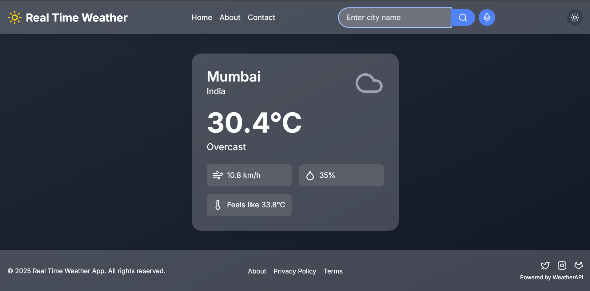
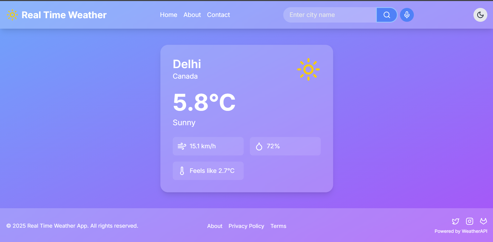

# Weather App 🌤️

## Overview

Weather App is a responsive and modern web application that allows users to check the current weather and forecast for any city around the world. The app fetches real-time weather data from a weather API and displays it in an easy-to-read and visually appealing format. The application also provides various additional features such as hourly forecasts, weekly weather data, and dynamic weather-based backgrounds.

## Features

- 🌤️ **View Current Weather**: Displays real-time weather data for any city.
- 🕓 **View Hourly Weather**: Plan your day with an hourly forecast.
- 📅 **View Weekly Forecast**: View a 7-day weather forecast for the selected city.
- 🌡️ **Detailed Weather Information**: Get temperature, humidity, wind speed, and more.
- 🌍 **Weather Data Caching**: The app supports offline mode, so you can access weather info even without internet.
- 🌐 **Localization**: Choose your preferred language.
- 🧮 **Metric or Imperial Units**: Customize the temperature and wind speed units.
- 🔄 **Celsius/Fahrenheit Toggle**: Switch between Celsius and Fahrenheit.
- ⏰ **12/24 Hour Time Formats**: Adjust the time display based on your preference.
- 🌈 **Dynamic Backgrounds**: The background image changes based on the current weather.
- 🌟 **Weather Icons**: Icons change based on the weather (e.g., sun, clouds, rain).

## Screenshots

Here are two screenshots of the Weather App:

### Screenshot 1


### Screenshot 2


## Tech Stack

- **Frontend**:
  - HTML5, CSS3, JavaScript
  - **API**: OpenWeatherMap API (or any other weather API)
  - **Framework**: None (Vanilla JS)
- **Design**:
  - Responsive design using Flexbox and CSS Grid
  - Modern UI with weather-specific icons and backgrounds
  
## How to Run the Project Locally

### Prerequisites

- You need [Node.js](https://nodejs.org/) installed on your machine.
- You'll need a weather API key from [OpenWeatherMap](https://openweathermap.org/api) or another weather service.

### Steps to Set Up the Project

1. Clone the repository:

 ```bash
   git clone https://github.com/Guten-Morgen1302/weather-app.git
Navigate to the project directory:

cd weather-app
Install the required dependencies (if any):

npm install
Add your API key to the project:

Open the script.js (or wherever the API key is used).
Replace the placeholder with your API key.
Open the index.html file in a web browser, or start a local server to run the project:

If you’re using VS Code, you can use the Live Server extension to launch it locally.
View the app in your browser at http://localhost:3000 (or the default port).

🤝 Contributing
Feel free to fork this repository and submit pull requests for improvements or additional features. If you have any issues or suggestions, feel free to open an issue in the repository.

📄 License
This project is licensed under the MIT License - see the LICENSE file for details.

🙏 Acknowledgments
Thanks to OpenWeatherMap for providing the weather API.
Inspiration from various weather apps for the design and functionality.
